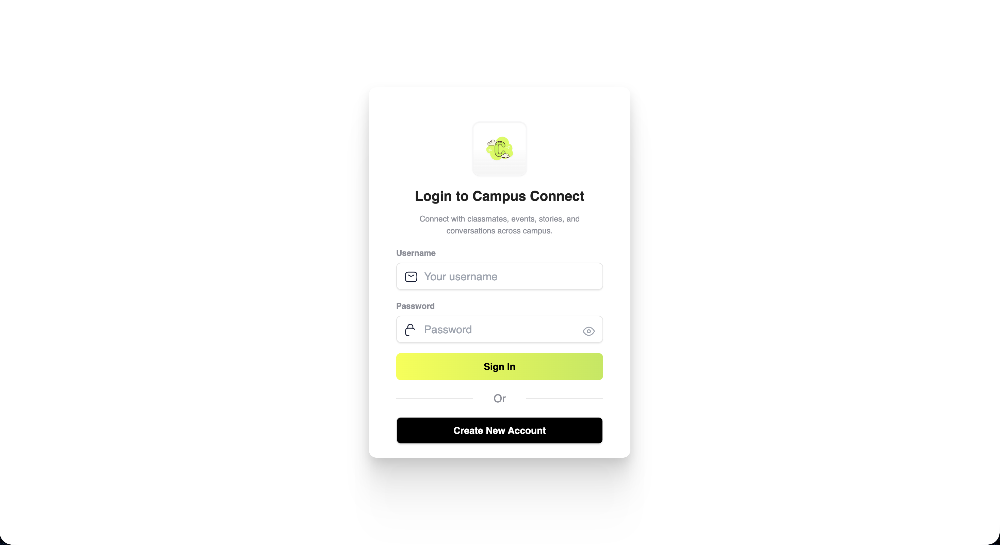
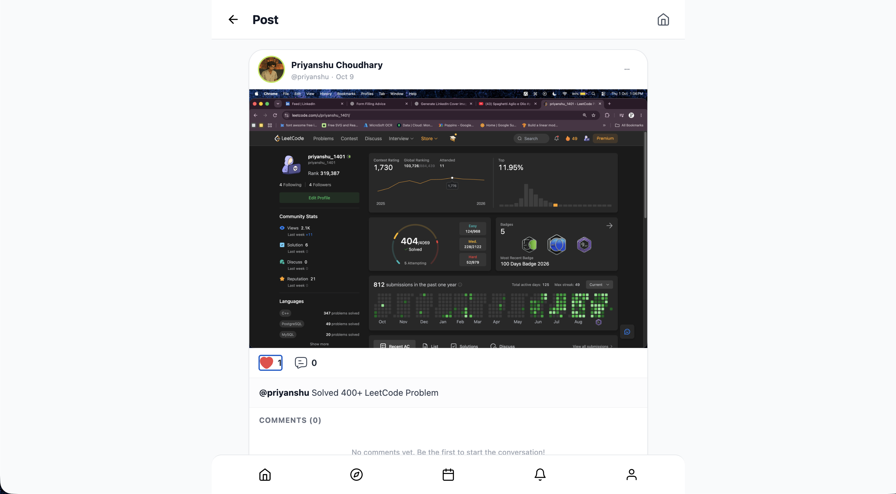
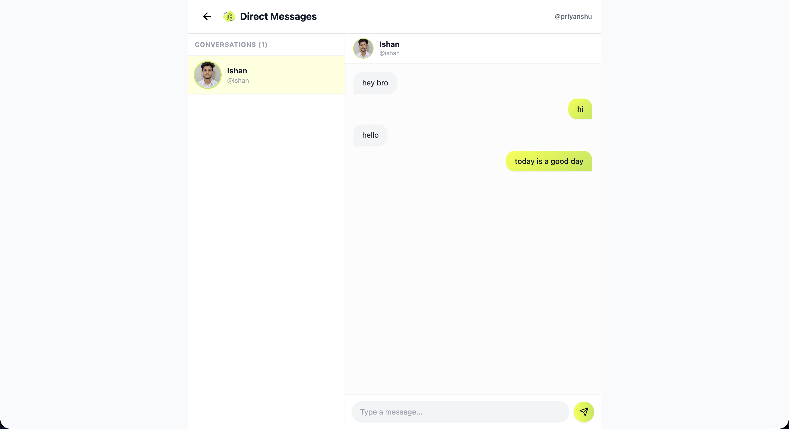
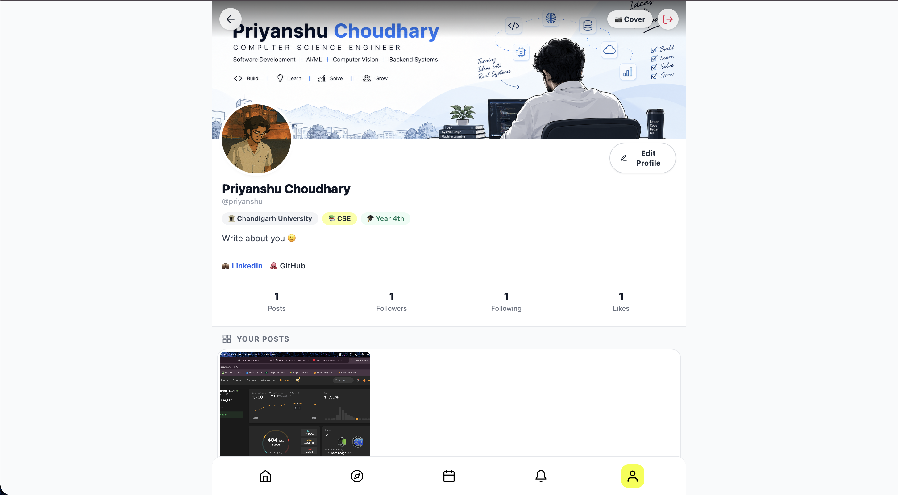

<div align="center">

# 🎓 Campus Connect v2.0
### *Next-Gen Real-Time Social & Collaboration Platform for College Campuses*

[](https://nodejs.org/)
[](https://expressjs.com/)
[](https://www.mongodb.com/)
[](https://socket.io/)
[](https://tailwindcss.com/)
[](https://cloudinary.com/)

<br />

**Campus Connect** is a full-stack campus community platform that fosters communication, event discovery, peer networking, and real-time interaction among college students.

Originally created as a 2nd year college prototype, **v2.0** represents a complete architectural overhaul transforming a basic student project into a robust, secure, production-grade social platform with instant messaging, live confessions, auto-expiring 24-hour stories, and automated notifications.

[Key Features](#-key-features) • [v1 vs v2 Evolution](#-v10-vs-v20-evolution) • [API & Endpoint Previews](#-api-endpoints--endpoint-previews) • [Getting Started](#%EF%B8%8F-getting-started) • [Security](#-security--architecture)

</div>

---

## 🌟 Visual Preview & Endpoint Interfaces

| **Login & Student Authentication** | **Home Feed & Infinite Scroll** |
| :---: | :---: |
|  |  |
| *Bcrypt verification & rate-limiting* | *Like Comment and Delete Post (Admin Only)* |

| **Real-Time Direct Messaging** | **Student Profile & Saved Posts** |
| :---: | :---: |
|  |  |
| *Socket.io private chat rooms* | *Branch, year, social links & cover upload* |

---

## 🚀 Key Features

### ⚡ 1. Real-Time Communication Hub
- **1-on-1 Direct Messaging (`/message`)**: Instant peer-to-peer chat powered by Socket.io with deterministic room creation (`userA-userB`) and asynchronous MongoDB persistence.
- **Campus Confessions (`/anyonomousChat`)**: Real-time anonymous confession stream broadcasted live to all online students, featuring an interactive upvoting system.

### 📸 2. Stories & Media Pipelines
- **24-Hour Auto-Expiring Stories**: Powered by MongoDB TTL (Time-To-Live) indexes (`expires: 86400`). Media automatically purges after 24 hours without background cron jobs.
- **Cloudinary Image Uploads**: Secure image processing pipeline for post images, event banners, and profile cover photos with 10MB file validation and MIME filtering.
- **Cascading Post Cleanup**: Deleting a post automatically destroys its Cloudinary media assets and associated database records (likes, comments).

### 🎓 3. Campus Ecosystem & Networking
- **Campus Events Board (`/events`)**: Discover hackathons, workshops, and college fests with interactive RSVP ("I'm Interested" counters) and poster uploads.
- **Explore & Peer Discovery (`/profile/explore`)**: Smart classmate recommendations filtered by college, branch, and academic year, alongside a 48-hour trending posts grid.
- **Activity Notifications (`/notifications`)**: Live notification center tracking post likes, comments, and new followers with unread badge indicators.
- **Feed Infinite Scroll**: Scalable AJAX pagination (`/api/posts?page=X`) replacing hardcoded feed limits.
- **Post Bookmarking (`/post/save/:id`)**: Save posts for quick reference later on your profile.

---

## 🔄 v1.0 vs v2.0 Evolution

| Feature / System | 🛑 v1.0 Prototype (2nd Year) | 🚀 v2.0 Production Overhaul |
| :--- | :--- | :--- |
| **Password Storage** | Plaintext strings | **Bcrypt hashing** (12 salt rounds) + auto-migration on login |
| **Session Management** | In-memory `MemoryStore` (wiped on restart) | **Persistent MongoDB sessions** (`connect-mongo`) with 7-day TTL |
| **Real-Time Communication**| None (HTTP page reloads required) | **Socket.io** integration for live DMs & confessions |
| **Feed Loading** | Hardcoded `limit(4)` without pagination | **AJAX Infinite Scroll** (`/api/posts?page=X`) |
| **Post Deletion** | Partial record removal | **Cascading cleanup** (Purges likes, comments & Cloudinary assets) |
| **Stories Lifecycle** | Manual cleanup required | **MongoDB TTL Indexes** (Auto-purges after 24 hours) |
| **Security & Routing** | Hardcoded `localhost:3000` URLs & inline secrets | **Relative routing**, `express-rate-limit`, `.env` isolation |
| **UX & Timestamps** | Static text ("1 min ago"), native popups | Dynamic relative times ("5m ago"), inline toasts, SVGs |

---

## 📡 API Endpoints & Endpoint Previews

### 🔑 Authentication & User Sessions
| Method | Endpoint | Description | Auth Required |
| :--- | :--- | :--- | :---: |
| `POST` | `/authentication/` | Authenticate user with bcrypt verification & session creation | ❌ |
| `POST` | `/authentication/signup` | Register new student profile with academic tags | ❌ |
| `GET` | `/logout` | Destroy session & purge auth cookies | ✅ |

### 📰 Feed & Posts Subsystem
| Method | Endpoint | Description | Auth Required |
| :--- | :--- | :--- | :---: |
| `GET` | `/` | Main feed rendered with stories, posts & unread count | ✅ |
| `GET` | `/api/posts` | Paginated post feed for infinite scroll | ✅ |
| `POST` | `/like/` | Toggle post like state & trigger notification | ✅ |
| `DELETE` | `/post/delete/:id` | Delete post with cascading cleanup & media destruction | ✅ |
| `POST` | `/post/save/:id` | Bookmark / save post to student profile | ✅ |

### 💬 Real-Time Messaging & Confessions
| Method | Endpoint | Description | Auth Required |
| :--- | :--- | :--- | :---: |
| `GET` | `/message` | Direct Messaging interface & active chat lists | ✅ |
| `GET` | `/anyonomousChat` | Anonymous campus confessions board | ✅ |
| `POST` | `/anyonomousChat/upvote/:id` | Upvote an anonymous campus confession | ✅ |

### 📅 Events, Explore & Notifications
| Method | Endpoint | Description | Auth Required |
| :--- | :--- | :--- | :---: |
| `GET` | `/events` | Campus events board (Upcoming & Past tabs) | ✅ |
| `POST` | `/events/create` | Create a new campus event with poster upload | ✅ |
| `POST` | `/events/interested/:id` | Toggle RSVP interest state on an event | ✅ |
| `GET` | `/profile/explore` | Classmate discovery hub & 48-hour trending grid | ✅ |
| `GET` | `/notifications` | Live activity notifications center | ✅ |
| `GET` | `/notifications/count` | Query unread notification badge count | ✅ |

---

## 🛠️ Tech Stack & Architecture

```
                          ┌───────────────────────────┐
                          │   Client Browser / EJS    │
                          └─────────────┬─────────────┘
                                        │
                         HTTP / REST    │   Socket.io (WebSockets)
                        ┌───────────────┴───────────────┐
                        │                               │
                        ▼                               ▼
             ┌─────────────────────┐         ┌─────────────────────┐
             │   Express Server    │         │  Socket.io Server   │
             │   (Node.js App)     │         │   (Real-Time Engine)│
             └──────────┬──────────┘         └──────────┬──────────┘
                        │                               │
       ┌────────────────┼────────────────┐              │
       │                │                │              │
       ▼                ▼                ▼              ▼
┌──────────────┐ ┌──────────────┐ ┌──────────────┐ ┌──────────────┐
│ MongoDB Atlas│ │ Connect-Mongo│ │ Bcrypt Auth  │ │ Cloudinary   │
│ (Data Models)│ │(Session Store│ │ (Encryption) │ │ (Media Pipeline)
└──────────────┘ └──────────────┘ └──────────────┘ └──────────────┘
```

- **Backend**: Node.js, Express.js
- **Database**: MongoDB Atlas, Mongoose ODM
- **Real-Time Layer**: Socket.io (WebSockets)
- **Frontend / Templating**: EJS (Embedded JavaScript), Tailwind CSS, Vanilla JS
- **Authentication & Security**: Bcrypt, Express Session, Connect-Mongo, Express Rate Limit
- **Media Management**: Cloudinary API, Multer

---

## 🛡️ Security & Architecture Upgrades

1. **Zero-Downtime Password Encryption**:  
   Newly registered users are hashed with `bcrypt` (12 salt rounds). Legacy v1 plaintext users are transparently verified on login and auto-upgraded in the database to bcrypt hashes on their next sign-in.
2. **Brute-Force Rate Limiting**:  
   Auth routes are protected via `express-rate-limit` allowing a maximum of 20 authentication attempts per 15-minute window per IP address.
3. **Reboot-Proof Session Store**:  
   Session state is offloaded to MongoDB using `connect-mongo`, enabling users to remain logged in across deployment restarts and server updates.
4. **Environment Isolation**:  
   All credentials (DB URIs, Cloudinary tokens, Session secrets) are strictly isolated in `.env` files and excluded from source control.

---

## ⚙️ Getting Started

### 📋 Prerequisites
- **Node.js** (v18.0.0 or higher)
- **npm** (v9.0.0 or higher)
- **MongoDB Atlas** cluster account (or local MongoDB daemon)
- **Cloudinary** free API credentials

### 🔧 Installation

1. **Clone the repository**:
   ```bash
   git clone https://github.com/Priyanshu0714/CampusConnect.git
   cd CampusConnect
   ```

2. **Install dependencies**:
   ```bash
   npm install
   ```

3. **Configure Environment Variables**:  
   Create a `.env` file in the root directory:
   ```env
   PORT=3000
   MONGO_URI=mongodb+srv://<username>:<password>@cluster0.mongodb.net/campusconnect?retryWrites=true&w=majority
   SESSION_SECRET=your_super_secret_session_key
   CLOUDINARY_CLOUD_NAME=your_cloud_name
   CLOUDINARY_API_KEY=your_api_key
   CLOUDINARY_API_SECRET=your_api_secret
   ```

4. **Build Tailwind CSS**:
   ```bash
   npm run build:css
   ```

5. **Start the Development Server**:
   ```bash
   npm run dev
   # Or start production server
   npm start
   ```

6. **Open application**:  
   Navigate to `http://localhost:3000` in your web browser.

---

## 🤝 Contributing

Contributions, issues, and feature requests are welcome!  
Feel free to check the [issues page](https://github.com/Priyanshu0714/CampusConnect/issues).

---

<div align="center">
  Crafted with ❤️ by a developer passionate about building campus communities.
</div>
